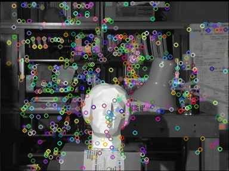

# Epipolar Geometry
This project is a simple project in Computer Vision to to find the epipolar lines of two images.

1.  Create SIFT images to find the key points of the images.

    
  
  <figcaption>
SIFT Image Right
</figcaption>

    
  
  <figcaption>
SIFT Image Left
</figcaption>

2.  We then find KNN Matchings for the images

    
  
  <figcaption>
KNN Matches
</figcaption>

3.  From the matchings, we chose 10 random points and find the Fundamental Matrix.

4.  We then find the Epipolar lines and plot it on the image.

    
  
  <figcaption>
SIFT Image Left
</figcaption>

    
  
  <figcaption>
SIFT Image Left
</figcaption>

